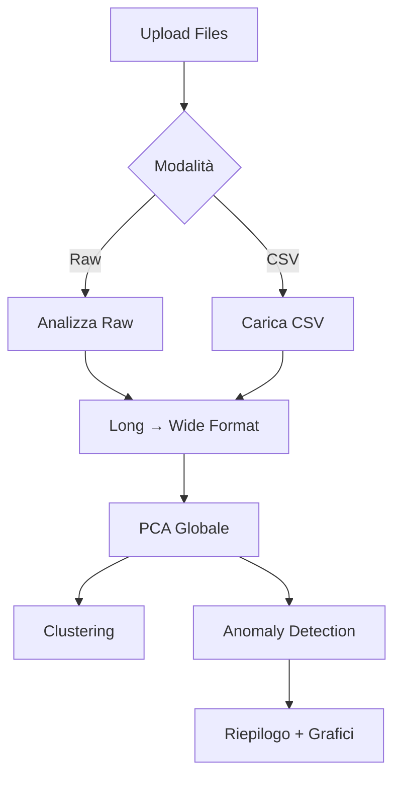

# 🧬 Protein Anomaly Detection Tool

Strumento di analisi per il rilevamento di anomalie in dinamiche proteiche tramite **PCA** e algoritmi di **machine learning**.

---

## 📋 Indice

- [Panoramica](#-panoramica)
- [Caratteristiche](#-caratteristiche)
- [Installazione](#-installazione)
- [Utilizzo](#-utilizzo)
- [Algoritmi Supportati](#-algoritmi-supportati)
- [Struttura del Progetto](#-struttura-del-progetto)
- [Flusso di Lavoro](#-flusso-di-lavoro)
- [Esempi](#-esempi)
- [Contribuire](#-contribuire)
- [Licenza](#-licenza)

---

## 🔬 Panoramica

Questo tool è stato sviluppato per analizzare serie temporali di angoli diedri (Phi, Psi) estratti da simulazioni di dinamica molecolare di proteine. L'applicazione web basata su **Dash/Plotly** permette di:

1. **Caricare dati raw** (multipli file di simulazione) o **CSV preprocessati**
2. **Applicare PCA** per riduzione dimensionale con trasformazioni sin/cos opzionali
3. **Eseguire clustering** (DBSCAN, OPTICS, Spectral Clustering)
4. **Rilevare anomalie** tramite regressione, metodi basati su distanze o clustering

---

## ✨ Caratteristiche

### 📊 Analisi Dati Raw
- Import automatico di file di simulazione multi-timepoint
- Conversione in formato **long** e **wide** (compatibile con il flusso del professore)
- Statistiche descrittive (media, varianza, range)
- Visualizzazioni interattive: serie temporali e scatter plot 2D (Phi vs Psi)

### 🔄 Preprocessing Avanzato
- **PCA globale** su tutte le finestre temporali
- Opzione **sin/cos transformation** degli angoli diedri
- Componenti configurabili (default: 3 PC)
- Grafici: andamento temporale PC, scatter 3D, parallel coordinates

### 🧩 Clustering
| Algoritmo | Parametri Chiave |
|-----------|------------------|
| **DBSCAN** | `eps`, `min_samples` |
| **OPTICS** | `min_samples`, `xi`, `min_cluster_size` |
| **Spectral** | `n_clusters`, `affinity` |

### 🚨 Anomaly Detection

#### **Modelli di Regressione**
- Linear Regression (base + Bagging con sin/cos)
- Random Forest + Bagging
- Gradient Boosting + Bagging
- Extra Trees + Bagging

#### **Metodi Basati su Distanze**
- **LOF** (Local Outlier Factor)
- **Matrix Profile** (STUMP)

#### **Metodi Basati su Clustering**
- DBSCAN (vector score)
- OPTICS (reachability score)
- K-Means (distance score)

---

## 🛠️ Installazione

### Prerequisiti
- Python 3.8+
- Git

### Setup

```bash
# Clona il repository
git clone https://github.com/alphio54/protein-anomaly-tool.git
cd protein-anomaly-tool

# Crea ambiente virtuale
python -m venv venv
source venv/bin/activate  # Su Windows: venv\Scripts\activate

# Installa dipendenze
pip install -r requirements.txt
```

### Dipendenze Principali
```
dash
plotly
pandas
numpy
scikit-learn
stumpy  # Per Matrix Profile
```

---

## 🚀 Utilizzo

### Avvio Applicazione

```bash
python main.py
```

Apri il browser su `http://127.0.0.1:8050`

### Workflow Base

#### 1️⃣ **Carica Dati**
- **Modalità Raw**: Carica multipli file di simulazione (`.txt`, `.dat`)
- **Modalità CSV**: Carica CSV preprocessato (formato wide: `residuo`, `angolo`, `time_0`, `time_1`, ...)

#### 2️⃣ **Analizza Dati Raw**
Genera:
- Tabella statistiche (Phi/Psi)
- Grafico andamento temporale
- Scatter plot 2D

#### 3️⃣ **Applica Preprocessing**
- Abilita/disabilita PCA
- Imposta numero componenti (default: 3)
- Opzionale: trasformazione sin/cos

#### 4️⃣ **Clustering** (opzionale)
Seleziona algoritmo e parametri per visualizzare cluster in 3D

#### 5️⃣ **Anomaly Detection**
- Scegli categoria (Regressione/Distanze/Clustering)
- Configura parametri modello
- Ottieni:
  - **Riepilogo testuale** (totale anomalie, % finestre anomale)
  - **Tabella dettagliata** (Time, PC, Error, Threshold)
  - **Grafici interattivi** per ogni PC

---

## 🧮 Algoritmi Supportati

### Anomaly Detection - Regressione

```python
# Linear Regression + Bagging
train_linear_regression_bagging(
    pca_df, 
    n=180,        # Finestre training
    w=20,         # Dimensione finestra
    num_models=10 # Modelli ensemble
)
```

### Anomaly Detection - Clustering

```python
# DBSCAN (vector score)
detect_anomalies_dbscan(
    pca_df,
    eps=0.25,
    min_samples=15,
    knn_k=10  # Opzionale: adattamento dinamico eps
)
```

### Threshold Variabili

```python
# Penalità customizzabile (default: 1)
calculate_variable_thresholds(errors, pen=2)
```

---

## 📁 Struttura del Progetto

```
protein-anomaly-tool/
│
├── app/
│   ├── __init__.py
│   ├── callbacks.py       # Logica Dash callbacks
│   └── layout.py          # UI components
│
├── logic/
│   ├── anomaly_detection.py   # Modelli anomaly
│   ├── clustering_utils.py    # DBSCAN, OPTICS, Spectral
│   └── pca_utils.py            # PCA + sin/cos
│
├── main.py                # Entry point
├── requirements.txt
└── README.md
```

---

## 🔄 Flusso di Lavoro



---

## 📊 Esempi

### Output Anomaly Detection

```
📊 ANOMALIE RILEVATE
─────────────────────────────────
Finestre analizzate: 40
🔴 Anomalie: 12 (30.0%)

Per componente:
• PC1: 5 anomalie (max: Time 235 → 3.45σ)
• PC2: 4 anomalie (max: Time 188 → 2.87σ)
• PC3: 3 anomalie (max: Time 210 → 2.12σ)
```

### Grafici Generati
- **Serie temporale errori** (per ogni PC)
- **Heatmap anomalie**
- **Scatter 3D** (PC1, PC2, PC3 con anomalie evidenziate)

---

## 🤝 Contribuire

1. Fork del progetto
2. Crea feature branch (`git checkout -b feature/AmazingFeature`)
3. Commit modifiche (`git commit -m 'Add AmazingFeature'`)
4. Push al branch (`git push origin feature/AmazingFeature`)
5. Apri Pull Request

---

## 📝 Licenza

Distribuito sotto licenza MIT. Vedi `LICENSE` per maggiori informazioni.

---

## 👤 Autore

**alphio54**  
GitHub: [@alphio54](https://github.com/alphio54)

---

## 🙏 Ringraziamenti

- Algoritmi PCA ispirati a metodologie di analisi conformazionale proteica
- Matrix Profile implementation: [STUMPY](https://github.com/TDAmeritrade/stumpy)
- UI framework: [Plotly Dash](https://dash.plotly.com/)

---

## 📚 Riferimenti

- [Scikit-learn Documentation](https://scikit-learn.org/)
- [OPTICS Clustering](https://en.wikipedia.org/wiki/OPTICS_algorithm)
- [Matrix Profile Foundation](https://www.cs.ucr.edu/~eamonn/MatrixProfile.html)