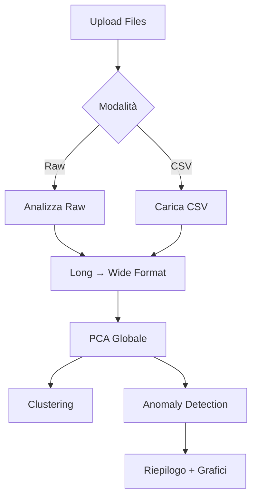

# 🧬 Protein Anomaly Detection Tool

Strumento di analisi per il rilevamento di anomalie in dinamiche proteiche tramite **PCA** e algoritmi di **machine learning**.

---

## 📋 Indice

- [Panoramica](#-panoramica)
- [Caratteristiche](#-caratteristiche)
- [Installazione](#-installazione)
- [Utilizzo](#-utilizzo)
- [Algoritmi Supportati](#-algoritmi-supportati)
- [Struttura del Progetto](#-struttura-del-progetto)
- [Flusso di Lavoro](#-flusso-di-lavoro)
- [Esempi](#-esempi)
- [Licenza](#-licenza)

---

## 🔬 Panoramica

Questo tool è stato sviluppato per analizzare serie temporali di angoli diedri (Phi, Psi) estratti da simulazioni di dinamica molecolare di proteine. L'applicazione web basata su **Dash/Plotly** permette di:

1. **Caricare dati raw** (multipli file di simulazione) o **CSV preprocessati**
2. **Applicare PCA** per riduzione dimensionale con trasformazioni sin/cos opzionali
3. **Eseguire clustering** (DBSCAN, OPTICS, Spectral Clustering)
4. **Rilevare anomalie** tramite regressione, metodi basati su distanze o clustering

---

## ✨ Caratteristiche

### 📊 Analisi Dati Raw
- Import automatico di file di simulazione multi-timepoint
- Conversione in formato **long** e **wide** (compatibile con il flusso del professore)
- Statistiche descrittive (media, varianza, range)
- Visualizzazioni interattive: serie temporali e scatter plot 2D (Phi vs Psi)

### 🔄 Preprocessing Avanzato
- **PCA globale** su tutte le finestre temporali
- Opzione **sin/cos transformation** degli angoli diedri
- Componenti configurabili (default: 3 PC)
- Grafici: andamento temporale PC, scatter 3D, parallel coordinates

### 🧩 Clustering
| Algoritmo | Parametri Chiave |
|-----------|------------------|
| **DBSCAN** | `eps`, `min_samples` |
| **OPTICS** | `min_samples`, `xi`, `min_cluster_size` |
| **Spectral** | `n_clusters`, `affinity` |

### 🚨 Anomaly Detection

#### **Modelli di Regressione**
- Linear Regression (base + Bagging con sin/cos)
- Random Forest + Bagging
- Gradient Boosting + Bagging
- Extra Trees + Bagging

#### **Metodi Basati su Distanze**
- **LOF** (Local Outlier Factor)
- **Matrix Profile** (STUMP)

#### **Metodi Basati su Clustering**
- DBSCAN (vector score)
- OPTICS (reachability score)
- K-Means (distance score)

---

## 🛠️ Installazione

### Prerequisiti
- Python 3.8+
- Git

### Setup

```bash
# Clona il repository
git clone https://github.com/alphio54/protein-anomaly-tool.git
cd protein-anomaly-tool

# Crea ambiente virtuale
python -m venv venv
source venv/bin/activate  # Su Windows: venv\Scripts\activate

# Installa dipendenze
pip install -r requirements.txt
```

### Dipendenze Principali
```
dash
plotly
pandas
numpy
scikit-learn
stumpy  # Per Matrix Profile
```

---

## 🚀 Utilizzo

### Avvio Applicazione

```bash
python main.py
```

Apri il browser su `http://127.0.0.1:8050`

### Workflow Base

#### 1️⃣ **Carica Dati**
- **Modalità Raw**: Carica multipli file di simulazione (`.txt`, `.dat`)
- **Modalità CSV**: Carica CSV preprocessato (formato wide: `residuo`, `angolo`, `time_0`, `time_1`, ...)

#### 2️⃣ **Analizza Dati Raw**
Genera:
- Tabella statistiche (Phi/Psi)
- Grafico andamento temporale
- Scatter plot 2D

#### 3️⃣ **Applica Preprocessing**
- Abilita/disabilita PCA
- Imposta numero componenti (default: 3)
- Opzionale: trasformazione sin/cos

#### 4️⃣ **Clustering** (opzionale)
Seleziona algoritmo e parametri per visualizzare cluster in 3D

#### 5️⃣ **Anomaly Detection**
- Scegli categoria (Regressione/Distanze/Clustering)
- Configura parametri modello
- Ottieni:
  - **Riepilogo testuale** (totale anomalie, % finestre anomale)
  - **Tabella dettagliata** (Time, PC, Error, Threshold)
  - **Grafici interattivi** per ogni PC

---

Ecco la sezione migliorata sugli algoritmi di Anomaly Detection:

```markdown
## 🚨 Anomaly Detection - Dettaglio Algoritmi

### 📈 **Metodi Basati su Regressione**

Questi metodi predicono il valore atteso di ogni componente principale e identificano come anomalie i punti con errore di predizione superiore a una soglia calcolata dinamicamente.

#### **Linear Regression + Bagging**
```python
train_linear_regression_bagging(pca_df, n=180, w=20, num_models=10)
```
- **Funzionamento**: Addestra `num_models` regressori lineari su finestre mobili di dimensione `w`
- **Ensemble**: Predizione finale = media delle predizioni dei modelli
- **Soglia**: `media(errori) + 2 * std(errori)` calcolata per ogni PC
- **Ottimale per**: Trend lineari, dati con varianza stabile

#### **Random Forest / Gradient Boosting / Extra Trees + Bagging**
```python
train_random_forest_bagging(pca_df, n=180, w=20, num_models=10)
```
- **Funzionamento**: Modelli ensemble basati su alberi decisionali con aggregazione bootstrap
- **Vantaggi**: Catturano relazioni non-lineari, robusti a outlier nel training set
- **Parametri chiave**:
  - `n`: finestre usate per training (default 180)
  - `w`: dimensione finestra temporale (default 20)
  - `num_models`: numero di modelli nell'ensemble (default 10)

---

### 📏 **Metodi Basati su Distanze**

#### **LOF (Local Outlier Factor)**
```python
detect_anomalies_lof(pca_df, n_neighbors=20, contamination=0.1)
```
- **Principio**: Misura la densità locale di ogni punto rispetto ai suoi vicini
- **Score**: LOF > 1 indica punto meno denso dei vicini (potenziale anomalia)
- **Parametri**:
  - `n_neighbors`: numero di vicini per calcolo densità locale
  - `contamination`: proporzione attesa di anomalie (0.1 = 10%)
- **Ottimale per**: Anomalie in regioni a bassa densità

#### **Matrix Profile (STUMPY)**
```python
detect_anomalies_matrix_profile(pca_df, m=10)
```
- **Funzionamento**: Calcola la distanza euclidea minima tra ogni sottosequenza e tutte le altre di lunghezza `m`
- **Discord**: Sottosequenze con massima distanza dal resto della serie temporale
- **Vantaggi**: 
  - Identifica pattern unici che non si ripetono
  - Non richiede labeled data
- **Parametri**:
  - `m`: lunghezza della sottosequenza (default 10 timepoints)
- **Ottimale per**: Anomalie contestuali in serie temporali

---

### 🧩 **Metodi Basati su Clustering**

#### **DBSCAN (Density-Based Spatial Clustering)**
```python
detect_anomalies_dbscan(pca_df, eps=0.25, min_samples=15, knn_k=10)
```
- **Principio**: Punti in regioni sparse (non raggruppabili in cluster) sono anomalie
- **Anomaly Score**: 
  - Punti noise (label -1) → anomalie dirette
  - Opzionale: distanza media dai `knn_k` vicini più prossimi
- **Parametri**:
  - `eps`: raggio massimo per considerare punti vicini
  - `min_samples`: minimo punti per formare un cluster denso
  - `knn_k`: vicini per calcolo score distanza (se abilitato)
- **Adattativo**: Se `knn_k` specificato, `eps` viene ricalcolato automaticamente

#### **OPTICS (Ordering Points To Identify Clustering Structure)**
```python
detect_anomalies_optics(pca_df, min_samples=15, xi=0.05, min_cluster_size=20)
```
- **Funzionamento**: Ordinamento basato su reachability distance (generalizzazione di DBSCAN)
- **Anomaly Score**: Alta reachability distance = punto isolato
- **Parametri**:
  - `min_samples`: stesso significato di DBSCAN
  - `xi`: pendenza minima del grafico reachability per estrarre cluster
  - `min_cluster_size`: dimensione minima cluster validi
- **Vantaggi**: Automatico su dataset con cluster a densità variabile

#### **K-Means Distance Score**
```python
detect_anomalies_kmeans(pca_df, n_clusters=5, threshold_percentile=95)
```
- **Principio**: Punti lontani dal centroide del proprio cluster sono anomalie
- **Anomaly Score**: Distanza euclidea dal centroide assegnato
- **Soglia**: Percentile della distribuzione delle distanze (default 95°)
- **Parametri**:
  - `n_clusters`: numero di cluster da creare
  - `threshold_percentile`: percentile per definizione anomalia (95 → top 5%)

### 📊 **Comparazione Algoritmi**

| Metodo | Tipo Anomalia | Complessità | Parametri Critici | Pro | Contro |
|--------|---------------|-------------|-------------------|-----|--------|
| **Linear Reg + Bagging** | Deviazioni da trend lineare | O(n) | `w`, `num_models` | Veloce, interpretabile | Solo trend lineari |
| **Random Forest** | Pattern non-lineari | O(n log n) | `w`, `num_models` | Robusto, cattura complessità | Meno interpretabile |
| **LOF** | Densità locale | O(n²) | `n_neighbors` | Identifica anomalie locali | Sensibile a scaling |
| **Matrix Profile** | Discords temporali | O(n² log n) | `m` | Preciso su serie temporali | Costoso computazionalmente |
| **DBSCAN** | Regioni sparse | O(n log n) | `eps`, `min_samples` | Robusto al rumore | Difficile tuning parametri |
| **OPTICS** | Multi-densità | O(n²) | `xi`, `min_cluster_size` | Automatico su densità variabili | Più lento di DBSCAN |
| **K-Means** | Distanza da centroidi | O(n·k·i) | `n_clusters` | Semplice, veloce | Assume cluster sferici |


### 📁 Struttura del Progetto

```
protein-anomaly-tool/
│
├── app/
│   ├── __init__.py
│   ├── callbacks.py       # Logica Dash callbacks
│   └── layout.py          # UI components
│
├── logic/
│   ├── anomaly_detection.py   # Modelli anomaly
│   ├── clustering_utils.py    # DBSCAN, OPTICS, Spectral
│   └── pca_utils.py            # PCA + sin/cos
│
├── main.py                # Entry point
├── requirements.txt
└── README.md
```

---

## 🔄 Flusso di Lavoro



---

## 📊 Esempi

### Output Anomaly Detection

```
📊 ANOMALIE RILEVATE
─────────────────────────────────
Finestre analizzate: 40
🔴 Anomalie: 12 (30.0%)

Per componente:
• PC1: 5 anomalie (max: Time 235 → 3.45σ)
• PC2: 4 anomalie (max: Time 188 → 2.87σ)
• PC3: 3 anomalie (max: Time 210 → 2.12σ)
```

### Grafici Generati
- **Serie temporale errori** (per ogni PC)
- **Heatmap anomalie**
- **Scatter 3D** (PC1, PC2, PC3 con anomalie evidenziate)


---

## 🚀 Sviluppi Futuri

### 📊 Funzionalità in Roadmap

- **Confronto Modelli Multi-Algoritmo**
  - Dashboard comparativa con metriche (precision, recall, F1-score)
  - ROC curves per valutazione performance
  - Voting ensemble automatico (combinazione predizioni)

- **Export e Reporting**
  - Generazione report PDF/HTML con grafici e statistiche
  - Export anomalie in formato annotato (CSV/JSON con timestamp e score)
  - Integrazione con sistemi di alert (email/Slack su anomalie critiche)

- **Analisi Avanzate**
  - Anomaly attribution: identificazione residui/angoli responsabili
  - Analisi causale tra componenti principali
  - Supporto per serie temporali multivariate (RMSD, RMSF, distanze inter-residui)

- **Scalabilità e Performance**
  - Processing parallelo per dataset di grandi dimensioni
  - Caching risultati PCA e clustering
  - Supporto GPU per algoritmi compute-intensive (Matrix Profile)

- **Interattività Avanzata**
  - Annotazione manuale anomalie con feedback loop
  - Timeline interattiva con zoom su finestre sospette
  - Filtri dinamici per visualizzazione (range temporale, residui specifici)


## 📝 Licenza

Distribuito sotto licenza MIT. Vedi `LICENSE` per maggiori informazioni.

---

## 👤 Autore

**alphio54**  
GitHub: [@alphio54](https://github.com/alphio54)

---

## 📚 Riferimenti

- [Scikit-learn Documentation](https://scikit-learn.org/)
- [OPTICS Clustering](https://en.wikipedia.org/wiki/OPTICS_algorithm)
- [Matrix Profile Foundation](https://www.cs.ucr.edu/~eamonn/MatrixProfile.html)